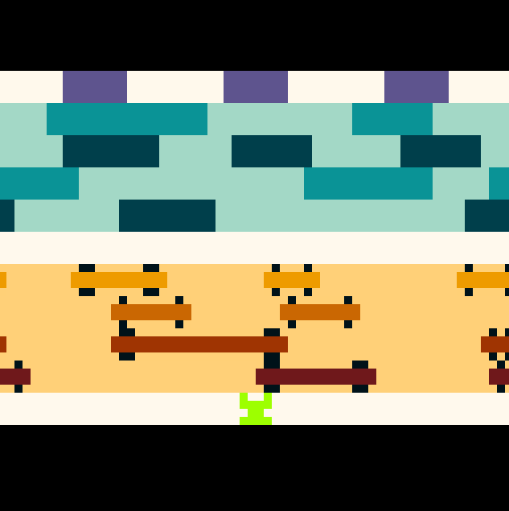

# Frogger
Frogger is a simple assembly version of the classic arcade game of the same name.

The frog moves through the scene avoiding obstacles (cars and water) to reach the goals. Difficulty increases as the game progresses; the game concludes when either all three goals are filled or all three lives are lost.

## Features
- Dynamic increase in difficulty (speed, obstacles, etc.) as game progresses
- Objects (frog, vehicles, etc) look more like the arcade version
- Four rows in each of the water and road sections
- A death/respawn animation each time the player loses a frog
- Frog points in the direction that it’s traveling
- Sound effects for movement, losing lives, collisions, and reaching the goal
- Pause whenever ‘p’ key is pressed, and resume the game when ‘p’ is pressed again

## Screen Captures

## How To Run
1. Install [MARS v4.5](https://courses.missouristate.edu/kenvollmar/mars/download.htm)
2. Open the file **frogger.asm** in MARS
3. Navigate to **Tools** and open 
    - Bitmap Display
    - Keyboard and Display MMIO Simulator
4. Connect them both to MIPS
5. Assemble and run the file
6. Enter keyboard inputs (a, s, d, f) into the **Keyboard and Display MMIO Simulator** window to make the frog move

## Author
* **Nehchal Kalsi** - *Project Developer* - [enn-cal](https://github.com/enn-cal)
